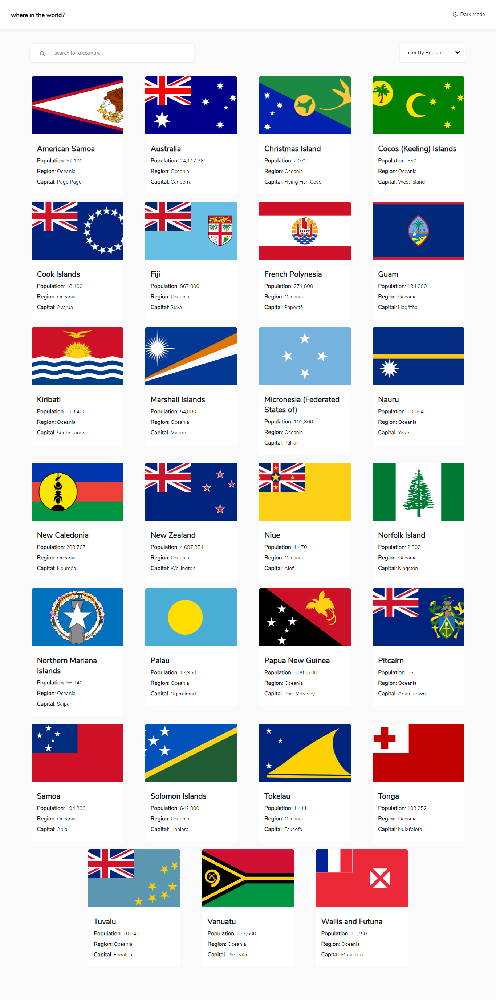
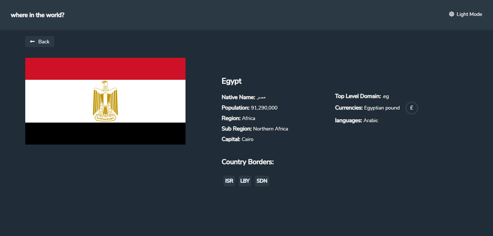

# Frontend Mentor - REST Countries API with color theme switcher solution

This is a solution to the [REST Countries API with color theme switcher challenge on Frontend Mentor](https://www.frontendmentor.io/challenges/rest-countries-api-with-color-theme-switcher-5cacc469fec04111f7b848ca). Frontend Mentor challenges help you improve your coding skills by building realistic projects. 

## Overview

### Screenshot

### Links

- Solution URL: [Solution](https://www.frontendmentor.io/solutions/vuejs-LtkP4gfE_)
- Live Site URL: [Live](https://rest-countries-api2021.netlify.app/)

### Built with

- Semantic HTML5 markup
- CSS custom properties
- Flexbox
- Mobile-first workflow
- [Vue](https://vuejs.org/) - JS Framework

## Author

- Author - [Mohamed Hesham]
- Frontend Mentor - [@mohamedhesham221](https://www.frontendmentor.io/profile/yourusername)
- Linkedin - [Mohamed Hesham](https://www.linkedin.com/in/mohamed-hesham-b7611618a/)
